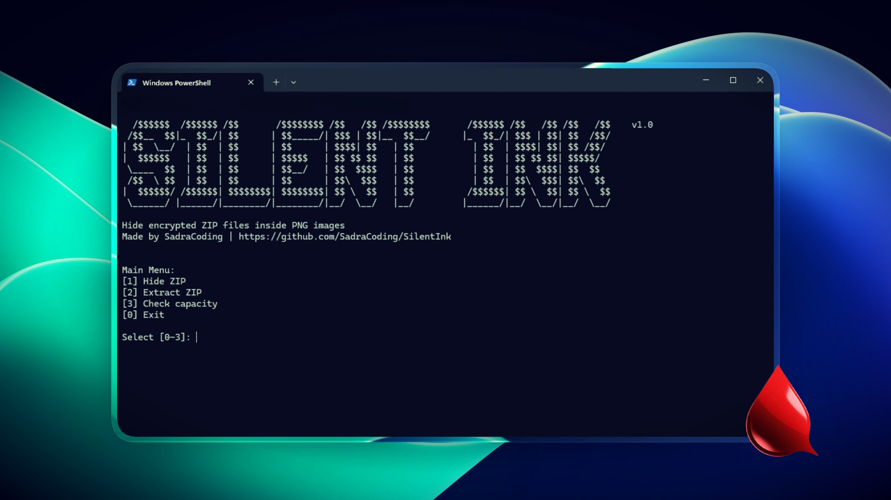

---

## ✨ Features

- 🔐 AES-256-GCM encryption
- 🔑 PBKDF2-HMAC-SHA512 (800k iterations)
- 🧂 Random salt per encryption
- 🖼 Lossless PNG embedding
- 🎨 Colorized animated CLI
- 🛡 Built-in integrity protection

---

## 🚀 Installation

```bash
git clone https://github.com/SadraCoding/SilentInk.git
cd SilentInk
pip install pillow cryptography colorama
python silent_ink.py
```

## 👨‍💻 Author

Made with 🖤 by **SadraCoding**

GitHub:  
https://github.com/SadraCoding

Project Repository:  
https://github.com/SadraCoding/SilentInk

